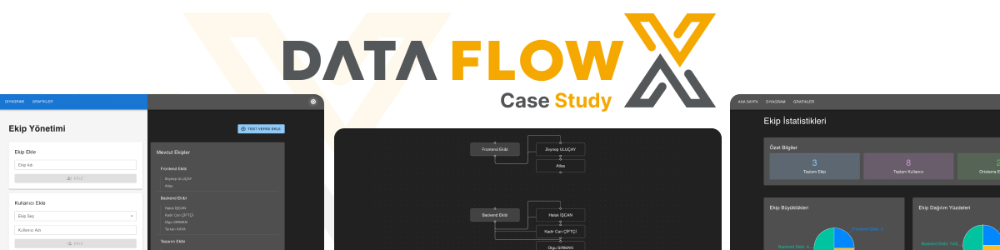

# Team Management Application - Case Study



A React application for managing teams and users with interactive visualizations using React Flow and Recharts.

Live Demo: [https://azateser.github.io/dataFlowX-CaseStudy/dist/](https://azateser.github.io/dataFlowX-CaseStudy/dist/)

## Case Requirements

### Core Features

1. **Team Management Forms**

   - Create teams with a dedicated form
   - Add users to teams with a separate form
   - State management using React Context

2. **Interactive Diagram (React Flow)**

   - Visual representation of teams and their users
   - Teams as parent nodes
   - Users as connected child nodes
   - Right-click context menu functionality:
     - Show/Hide team users
     - Remove users from teams

3. **Analytics (Recharts)**
   - Pie Chart visualization
   - Bar Chart visualization
   - Team and user statistics

### Technical Requirements

- Built with Vite and TypeScript
- Modern UI/UX principles
- Type safety throughout the application

## Tech Stack

**Core**


**UI Components**

- Material UI
- React Flow (for diagrams)
- Recharts (for analytics)

**State Management**

- React Context API

**Routing**

- React Router DOM

**Notifications**

- React Toastify

## Features

**Team Management**

- Create and delete teams
- Add and remove users from teams
- Context-based state management
- Quick test data population

**Interactive Diagram**

- Hierarchical team structure visualization
- Context menu for team/user actions
- Show/hide team members
- Draggable nodes and smooth connections
- Custom node styling

**Analytics Dashboard**

- Team size distribution (Pie Chart)
- User distribution (Bar Chart)
- Team activity metrics
- Summary statistics

**Modern UI/UX**

- Material UI components
- Dark/Light theme support
- Responsive design
- Toast notifications
- Intuitive user interactions

## Getting Started

### Prerequisites

- Node.js (v14 or higher)
- npm (v6 or higher)

### Installation

1. Clone the repository

```bash
git clone https://github.com/azateser/dataFlowX-CaseStudy
```

2. Navigate to project directory

```bash
cd dataFlowX-CaseStudy
```

3. Install dependencies

```bash
npm install
```

4. Start the development server

```bash
npm run dev
```

The application will be available at `http://localhost:5173`

## Project Structure

```
src/
├── components/     # Reusable UI components
│   ├── TeamForm/  # Team creation form
│   └── UserForm/  # User creation form
├── constants/     # Application constants
├── context/      # React context providers
│   ├── TeamContext/    # Team state management
│   └── ThemeContext/   # Theme state management
├── hooks/        # Custom React hooks
├── mocks/        # Mock data for testing
├── pages/        # Page components
│   ├── Home/     # Forms and team list
│   ├── Diagram/  # React Flow diagram
│   └── Charts/   # Recharts visualizations
├── styles/       # CSS and theme styles
├── types/        # TypeScript definitions
└── utils/        # Utility functions
```

## Available Scripts

- `npm run dev` - Start development server
- `npm run build` - Build for production
- `npm run lint` - Run ESLint
- `npm run preview` - Preview production build

## Key Features Implementation

### Context Menu Actions

- Right-click on team nodes to:
  - Toggle visibility of connected users
  - Remove team and all its users
- Right-click on user nodes to:
  - Remove user from team

### Theme Support

- Light/Dark mode toggle
- Persistent theme preference
- Styled components integration
